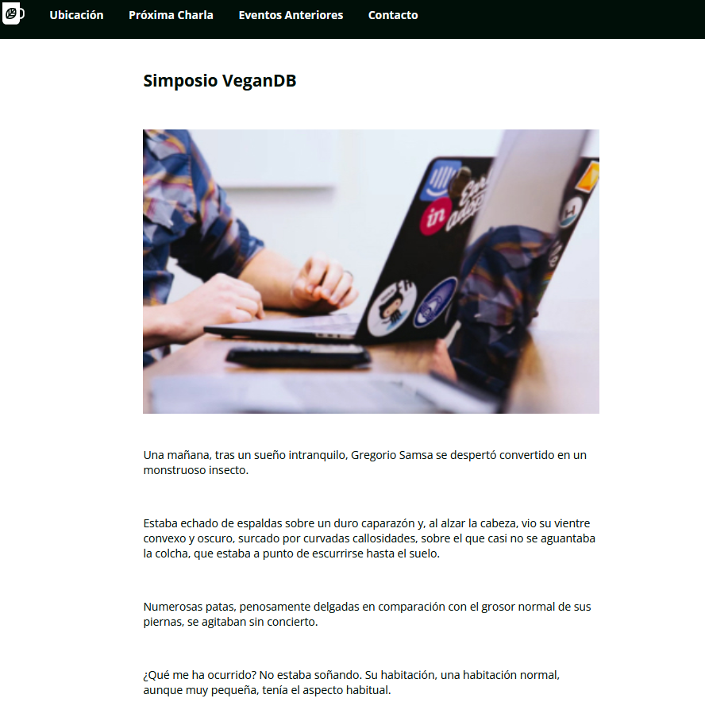
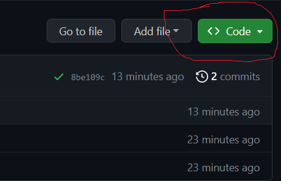
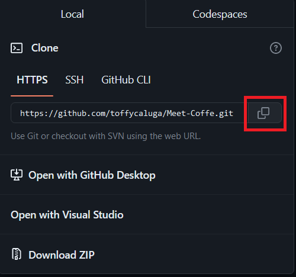

- en este proyecto aprendi:
  - buenas practicas para css y html.
  - bases mas solidas en css.
  - uso de clases e ids.
  - utilizar correctamente etiquetas semanticas en html.

## Como instalar y ejecutar el proyecto


<!-- ## Badges

Images that convey metadata, for example if all the tests are passing or not in the project.
 -->
## Visuals

<!-- Screenshots, videos or GIFs of the project. -->
### index

### evento 01



## Starting 🚀
- en este repositorio, en su pagina principal . sobre la lista de archivos haz click en Code.




- luego copia la url de el repositorio



### Pre-requisites 📋

Dependencies to run the project:

* Operating system Ver. XXXX
* Programming language Ver. XXXX
* Framework and its version Ver. XXXX
* Database Ver. XXXX
* etc

### Installation 🔧

Steps to install and run the project locally

```bash
step 1
```

And repeat

```bash
step 2
```

## Running the tests ⚙️

Description of how to run the tests:

```bash
give an example
```

### Analyze end-to-end tests 🔩

Explain the reasons for the tests, what they verify and how to interpret the results

### Coding style tests ⌨️

Description of style tests

```bash
give an example
```

## Deployment 📦

Description of how to bring the project to production

## Built with 🛠️

Tools used to create the project

* [Ruby](https://www.ruby-lang.org/en/) - Programming language used
* [Ruby on Rails](https://rubyonrails.org) - The web framework used
* [Ruby gems](https://rubygems.org) - Dependency manager
* [Postgresql](https://www.postgresql.org) - Database
* [Bulma IO](https://bulma.io) - Css Framework

## Contribute 🖇️

Please read [CONTRIBUTING.md](https://gist.github.com/brayandiazc/xxxxxx) for details of our code of conduct, and the process for submitting pull requests.

## Wiki 📖

Find more information on how to use it in [Wiki](https://github.com/your/project/wiki)

## Medium

Ways to get help:

* Forum
* Email
* Group

## Roadmap

Ideas for future versions.

## Versioning 📌

Version control system [Git](https://git-scm.com).
For all available versions, check out the [tags in this repository](https://github.com/tu/proyecto/tags).

## Authors ✒️

People who have contributed to the project:

* **Brayan Diaz C** - *Initial Work* - [brayandiazc](https://brayandiazc.com)
* **Gloria Salcedo** - *Documentation* - [brayandiazc](https://loha.com)

You can also look at the list of all [contributors](https://github.com/your/project/contributors) who have participated in this project.

## License 📄

This project is under the License (Your License) - see the file [LICENSE.md] (LICENSE.md) for details

## Expressions of Gratitude 🎁

This readme file is developed using as reference the following projects:

* [README-español.md](https://gist.github.com/Villanuevand/6386899f70346d4580c723232524d35a) - created by [Andrés Villanueva](https://gist.github.com/Villanuevand)
* [Make a README](https://www.makeareadme.com) - created by [Danny Guo](https://github.com/dguo)
* Invite a beer 🍺 or a coffee ☕ to someone on the team.
* Give thanks publicly 🤓.
* etc.

---
⌨️ with ❤️ by [Brayan Diaz C](https://github.com/brayandiazc) 😊


# Título del Proyecto

Meet & Coffee, 
descubre lo ultimo en tecnologia
## Descripción 
Proyecto realizado para fortalecer bases de css y html , efectuado por inforcap para bootcamp Ruby on Rails.

Este trata de un lugar de encuentro para hablar de tecnologia y beber un buen cafe en el proceso.

## Comenzando 🚀

_Estas instrucciones te permitirán obtener una copia del proyecto en funcionamiento en tu máquina local para propósitos de desarrollo y pruebas._

Mira **Deployment** para conocer como desplegar el proyecto.


### Pre-requisitos 📋

tener instalado algún editor de código 

```
visual studio code
sublime Text
etc..

```

### Instalación 🔧
- en este repositorio, en su pagina principal . sobre la lista de archivos haz click en Code.


- luego copia la url de el repositorio


utiliza el comando git clone para clonar este repositorio , desde tu terminal, ubicado en el directorio donde guardaras el proyecto:

```
$ git clone https://github.com/toffycaluga/Meet-Coffee.git
```
presiona enter , aparecera un ensaje como este:

```
$ git clone https://github.com/YOUR-USERNAME/YOUR-REPOSITORY
> Cloning into `Spoon-Knife`...
> remote: Counting objects: 10, done.
> remote: Compressing objects: 100% (8/8), done.
> remove: Total 10 (delta 1), reused 10 (delta 1)
> Unpacking objects: 100% (10/10), done.
```


_Finaliza con un ejemplo de cómo obtener datos del sistema o como usarlos para una pequeña demo_


## Despliegue 📦

_Agrega notas adicionales sobre como hacer deploy_

## Construido con 🛠️

* **HTML**
* **CSS**


## Versionado 📌
se uso github parar el versionado
## Autores ✒️

* **Abraham Lillo** - *Trabajo Inicial* - [toffycaluga](https://github.com/toffycaluga)


También puedes mirar la lista de todos los [contribuyentes](https://github.com/your/project/contributors) quíenes han participado en este proyecto. 


## Licencia 📄

Este proyecto está bajo la Licencia (Tu Licencia) - mira el archivo [LICENSE.md](LICENSE.md) para detalles

## Expresiones de Gratitud 🎁
Este archivo README se desarrolla utilizando como referencia los siguientes proyectos:

* [README-español.md](https://gist.github.com/Villanuevand/6386899f70346d4580c723232524d35a) - created by [Andrés Villanueva](https://gist.github.com/Villanuevand)
* [Make a README](https://www.makeareadme.com) - created by [Danny Guo](https://github.com/dguo)
* [README](https://github.com/brayandiazc/template-readme/blob/main/README.md?plain=1)- inspirado por [Brayan Diaz](https://github.com/brayandiazc)
* Comenta a otros sobre este proyecto 📢
* Invita una cerveza 🍺 o un café ☕ a alguien del equipo. 
* Da las gracias públicamente 🤓.
* Dona con cripto a esta dirección: `0xf253fc233333078436d111175e5a76a649890000`
* etc.


---
⌨️ con ❤️ por [Toffy Calua](https://github.com/toffycaluga) 😊